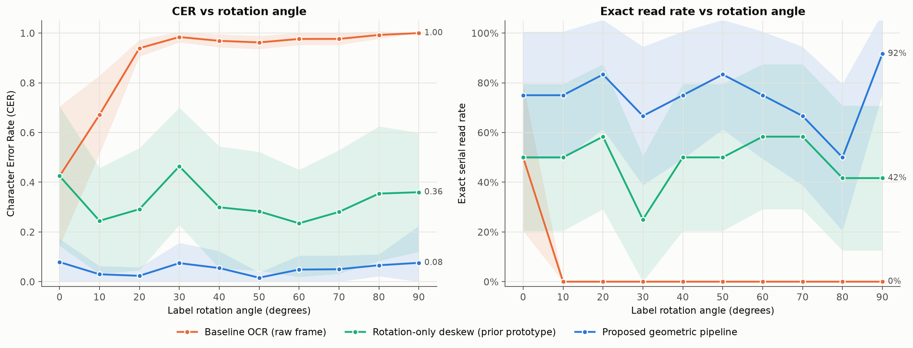
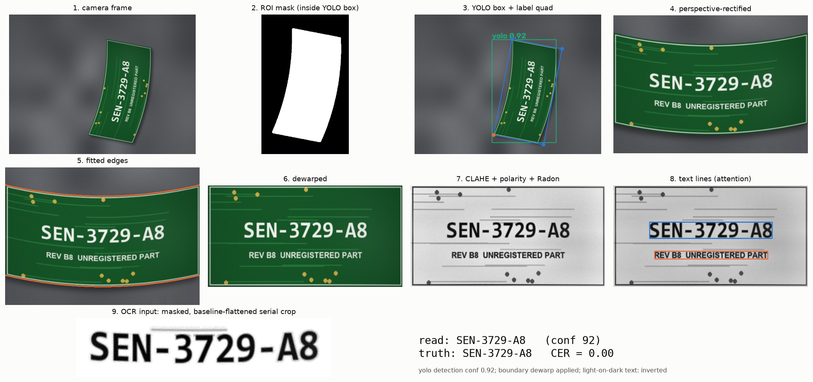
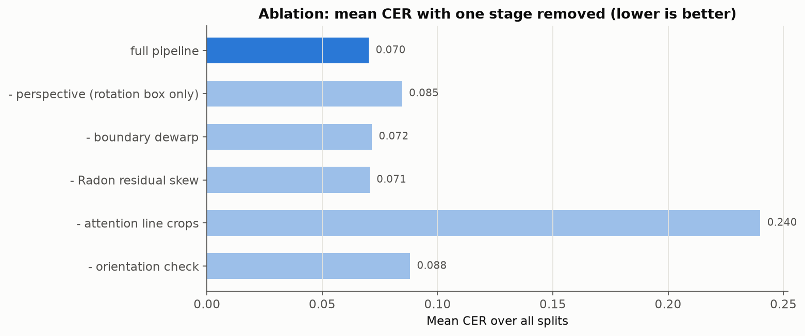

# Edge-Assisted Serial Label Verification

**Reads serial-number labels at any angle and checks them against inventory, on a laptop CPU.**
A geometric pre-processing layer between YOLO detection and OCR cuts the character error rate of the same OCR engine
from **0.908 to 0.070** on rotated, tilted, bent and crumpled labels. Across 496 test frames, no unknown or faulty
part was ever accepted.



*Out-of-the-box OCR fails once a label turns more than about 10°; the pipeline stays flat from 0 to 90°.
All three methods use the same OCR engine, character set and serial extraction, so the difference comes from the geometry alone.*

---

## Results

Evaluated on 496 synthetic camera frames with exact ground truth (per-image results in [`outputs/results/`](outputs/results)).

| Method | Character error rate ↓ | Serial read exactly | Correct PASS / MISMATCH / ERROR |
| --- | --- | --- | --- |
| Raw frame → Tesseract (baseline) | 0.908 | 3 % | 5 % |
| Rotate frame level → Tesseract (first prototype) | 0.352 | 43 % | 59 % |
| **YOLO → geometric layer → Tesseract (this repo)** | **0.070** | **71 %** | **92 %** |

| Other checks | Result |
| --- | --- |
| False PASS (unknown or faulty part given a green light) | **0 of 141** |
| YOLO11n label detection, held-out frames | 100 % found at IoU ≥ 0.5, mean IoU 0.96 (val mAP50 0.995) |
| Same layer in front of EasyOCR instead of Tesseract | CER 0.528 → 0.019 |
| Decision rules (unit cases) | 10 / 10 |
| End-to-end time per item | median 1.06 s on an Intel Core Ultra 7 laptop CPU, plugged in (about 3× slower on battery) |

## How it works



1. **Detect:** YOLO11n finds the label and crops a region of interest with a 12 % margin.
   The classical locator is the fallback.
2. **Segment:** a CIE-Lab colour model of the mat (taken from the ROI border, with shadows down-weighted) separates
   label from background.
3. **Rectify:** a 4-corner fit (or a min-area box, whichever overlaps the mask better) and a homography remove
   rotation and camera tilt in one step.
4. **Dewarp:** the label's top and bottom edges are fitted with robust polynomials, and columns are re-sampled to
   straighten bends (skipped when the fit is poor).
5. **Normalise:** CLAHE for uneven light; text polarity is detected and inverted for white-on-green PCB silkscreen.
6. **Deskew:** a projection-profile (Radon) search removes the last few degrees.
7. **Attention crops:** text lines are isolated, and borders, QR codes and specks are masked out. Each line's
   baseline is flattened.
8. **Read:** Tesseract reads line by line, with a confidence-guided retry at 3 scales and a 0°/180° orientation check.
9. **Verify:** the serial is normalised, format-checked and fuzzy-matched against SQLite (≤ 2 edits, unambiguous).
   An optional QR code is cross-checked. The decision is **PASS / MISMATCH / ERROR**.
10. **Signal:** one byte over USB serial (`G` / `R` / `E`) drives a green LED, red LED or buzzer on an Arduino or Pico.

## What each stage contributes (ablation)



The attention line crops carry most of the gain. Perspective rectification and the orientation check matter on their
target conditions (tilt; labels near 90°). The boundary dewarp is close to neutral overall: it helps on crumpled
labels and slightly hurts on bent ones. It is the first stage to improve.

## Quick start

Requires Python 3.10+ and [Tesseract 5](https://github.com/UB-Mannheim/tesseract/wiki).

```bash
git clone https://github.com/Riyann69/Edge-Assisted-Automated-Inventory-Tracking-Serial-Label-Verification.git
cd Edge-Assisted-Automated-Inventory-Tracking-Serial-Label-Verification
pip install opencv-python pytesseract python-Levenshtein pillow matplotlib pandas qrcode pyzbar pyserial flask easyocr polars jupyter
pip install ultralytics --no-deps   # --no-deps keeps your existing OpenCV build
jupyter notebook label_verification_pipeline.ipynb   # then Run All
```

On a fresh clone, the first run regenerates the seeded synthetic datasets (about 1 minute) and trains the YOLO detector
(about 25 minutes on a laptop CPU). Later runs reuse everything they cached. The `RUN_*` / `TRAIN_YOLO` flags at the top
of the notebook skip the slow steps.

## Use your own photos or camera

| Input | How |
| --- | --- |
| Folder of phone photos | Put them in `data/real/images/` and add `images/IMG_2041.jpg,SN-284517-XJ,30` (file, true serial, optional angle) to `data/real/annotations.csv`. Section 11 then reports the same metrics on real data |
| Phone as a webcam | IP Webcam or DroidCam app, then `SOURCE = "http://<phone-ip>:8080/video"` |
| Phone browser upload | `START_PHONE_SERVER = True`, open `http://<laptop-ip>:5000` on the phone (same Wi-Fi) |
| USB webcam station | `SOURCE = 0`, then `live_scan(0)`: scans automatically when an item is placed and stops moving |

## Hardware

Arduino sketch in [`hardware/indicator/indicator.ino`](hardware/indicator/indicator.ino): green LED on D8, red LED on
D9 (each through 220 Ω), active buzzer on D10, 9600 baud. A MicroPython version for the Raspberry Pi Pico is in
[`hardware/pico_main.py`](hardware/pico_main.py). Without a board connected, the notebook simulates the indicator.

## Repository layout

```
├── label_verification_pipeline.ipynb   # the whole pipeline, evaluation and figures
├── data/
│   ├── inventory.csv                   # seed stock list (60 serials, 4 flagged FAULTY)
│   └── real/annotations.csv            # template for your own labelled photos
├── outputs/
│   ├── figures/                        # every figure in this README and the report
│   ├── results/                        # per-image results: main run, detection, ablation, EasyOCR
│   └── yolo/label_detector/            # YOLO training curves and hyperparameters
└── hardware/                           # Arduino and Pico firmware
```

Generated data (`data/synthetic/`, `data/yolo/`), model weights and the runtime database are rebuilt by the notebook
and are not committed.

## Limitations

- **Synthetic evaluation so far.** Real-photo results are the next milestone; the real-data path above runs the
  identical evaluation.
- **Shipping labels in the OCR-A font** read exactly only 20 % of the time. 90 of the pipeline's 92 most common character
  confusions (6→B, 0→O, 8→A) come from that font, so this is an OCR problem, not a geometry one.
- **Heavy crumpling** (creases through characters) drops exact reads to 47 %.
- Assumes a fixed overhead camera, a mat that contrasts with the object, and one label per frame.

## Team

Capstone project, VIT-AP University: Vishal Koushik, Gowthami Ambati, Ruth Caroline and Riyan Wankhede.
<!-- Add each member's role here, e.g. "Riyan Wankhede: geometric pre-processing layer and evaluation". -->

## Licence

Code in this repository is MIT licensed (see [LICENSE](LICENSE)). The YOLO detector uses
[Ultralytics](https://github.com/ultralytics/ultralytics), which is licensed under **AGPL-3.0**. Its pretrained weights
and the detector trained from them are therefore not redistributed here; the notebook downloads and trains them
locally. Distributing a build that includes the Ultralytics detector is subject to AGPL-3.0 terms. The classical
locator fallback has no such dependency.
